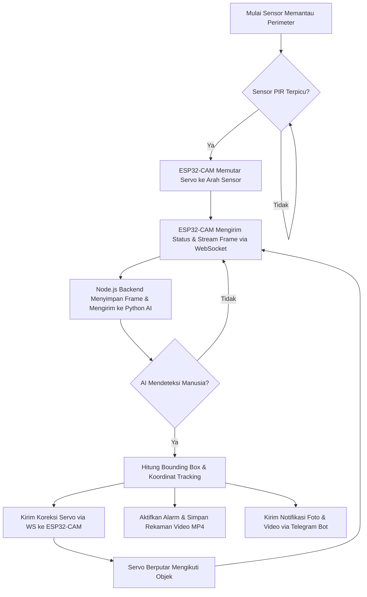
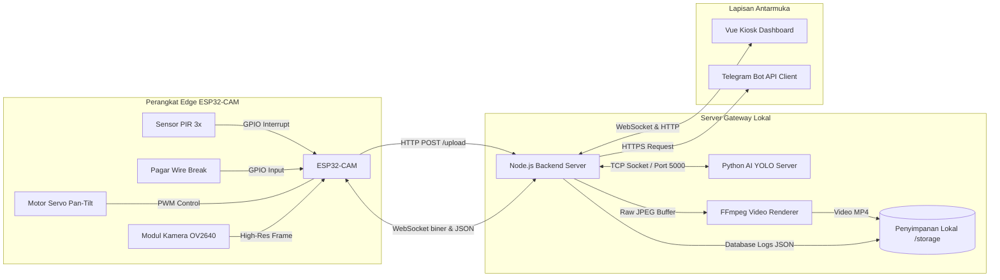
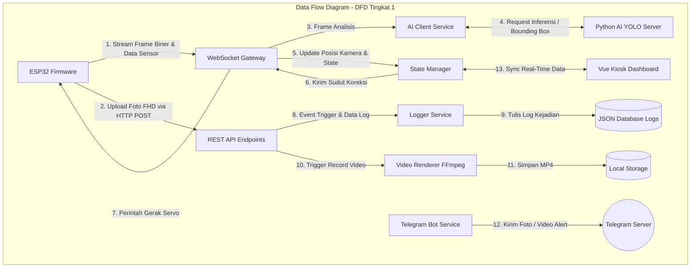
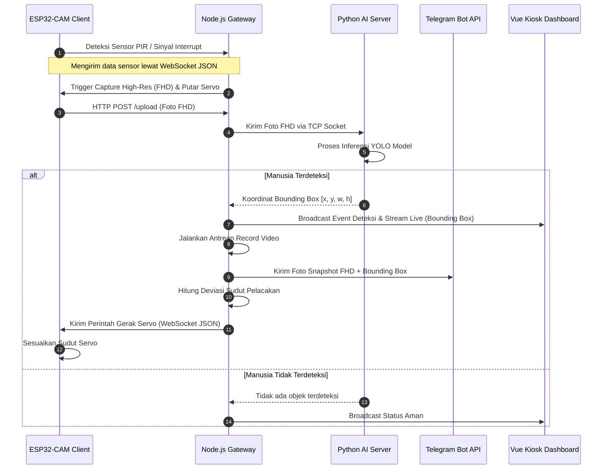
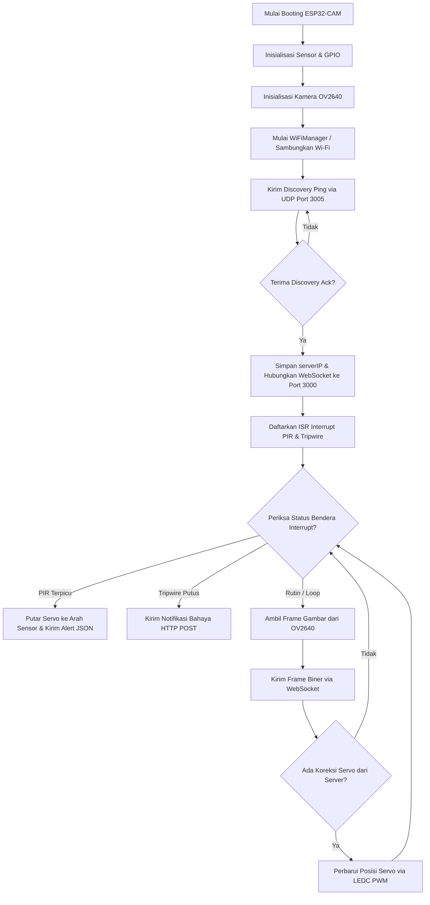
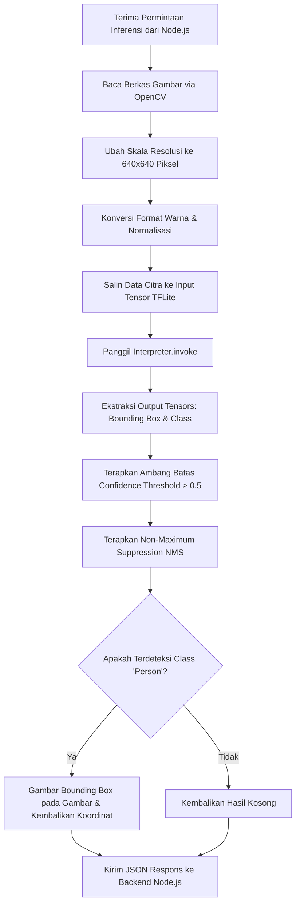
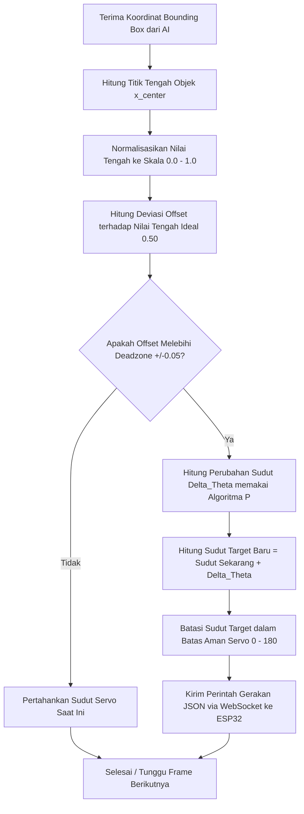
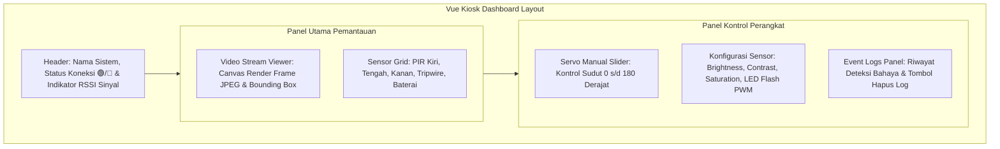
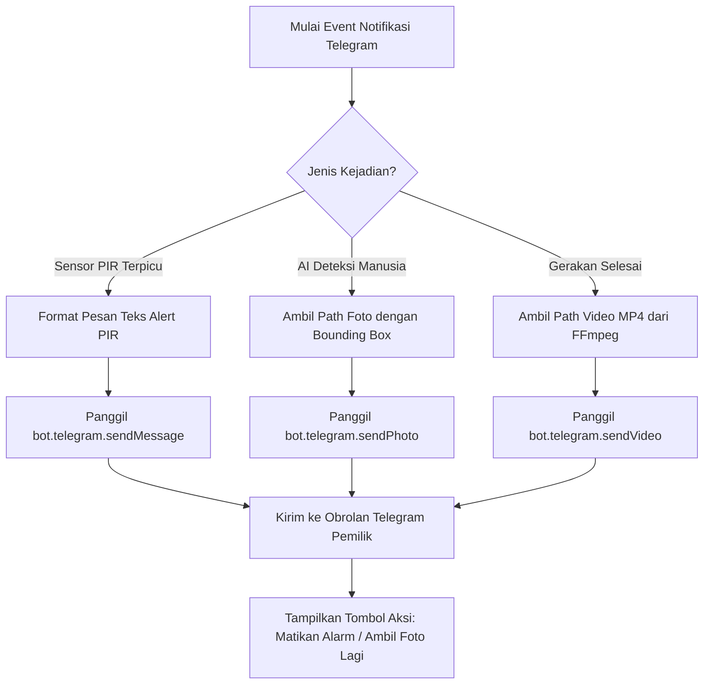

# BAB IV IMPLEMENTASI SISTEM

## 4.1 Gambaran Umum Implementasi Sistem

Implementasi sistem merupakan tahap penerjemahan spesifikasi dan desain rancangan yang telah ditentukan pada tahap Capstone Design 3 (CD3) ke dalam bentuk fisik perangkat keras dan modul-modul program perangkat lunak. Tujuan utama dari implementasi sistem ini adalah mewujudkan sistem keamanan peternakan ayam berbiaya rendah yang tangguh, mandiri, dan efisien secara operasional. Dengan memfokuskan pemrosesan pada arsitektur *edge computing* lokal, sistem ini dirancang untuk dapat beroperasi secara penuh di dalam jaringan intranet tanpa bergantung pada konektivitas internet luar, sehingga meminimalisasi biaya langganan layanan *cloud* dan menghindari risiko kegagalan sistem akibat hilangnya koneksi internet publik.

Arsitektur sistem ini mengintegrasikan komponen perangkat keras (*hardware*) dan perangkat lunak (*software*) secara terdistribusi. Sektor perangkat keras diposisikan di perimeter luar peternakan (*edge nodes*) menggunakan mikrokontroler ESP32-CAM yang dilengkapi dengan sensor *Passive Infrared* (PIR) tiga arah dan sensor kawat pengaman (*wire break* / *tripwire*). Sektor perangkat lunak dipusatkan pada komputer server lokal (*gateway server*) yang menjalankan aplikasi backend berbasis Node.js dan pemrosesan kecerdasan buatan (*Artificial Intelligence*) berbasis Python. Hubungan antara perangkat keras dan perangkat lunak ini dijembatani oleh protokol komunikasi jaringan lokal nirkabel (Wi-Fi) berbasis TCP/IP melalui soket WebSocket biner untuk pengiriman aliran gambar secara *real-time* dan protokol HTTP REST untuk pertukaran perintah serta konfigurasi sistem.

Alur kerja (*workflow*) implementasi sistem dimulai dari pengenalan aktivitas oleh sensor fisik di perimeter luar. Tiga sensor PIR yang diletakkan pada posisi kiri, tengah, dan kanan bertugas mendeteksi perubahan radiasi inframerah akibat adanya pergerakan makhluk hidup. Sinyal perubahan logika tegangan dari sensor PIR dibaca oleh pin GPIO input pada ESP32-CAM. Ketika gerakan terdeteksi, firmware ESP32-CAM akan mengeksekusi interupsi untuk memutar motor servo pan-tilt ke sudut deteksi yang sesuai (kiri, tengah, atau kanan) dan secara simultan mengirimkan notifikasi *event* serta mulai mengalirkan frame-frame gambar JPEG ke backend Node.js melalui koneksi WebSocket.

Setelah menerima data frame gambar, backend server Node.js akan bertindak sebagai *orchestrator* dengan menyangga (*buffering*) gambar tersebut dan secara asinkron meneruskannya ke modul deteksi manusia berbasis AI (*AI Human Detection*) di server Python. Server Python yang memuat model pembelajaran mesin ringan (YOLO) akan mengevaluasi gambar untuk memverifikasi apakah objek yang terdeteksi merupakan manusia. Jika AI memverifikasi keberadaan manusia dengan tingkat kepercayaan di atas ambang batas (*threshold*), server AI akan mengembalikan koordinat kotak pembatas (*bounding box*) ke backend Node.js. Koordinat ini selanjutnya digunakan oleh modul *Object Tracking* untuk mengirimkan koreksi sudut pergerakan servo secara dinamis ke ESP32-CAM agar kamera terus mengikuti pergerakan manusia tersebut. Pada saat yang bersamaan, sistem akan memicu alarm lokal, merekam klip kejadian, dan mengirimkan pesan peringatan berupa foto cuplikan ber-*bounding box* serta video rekaman kejadian ke Telegram Bot pemilik peternakan.



Secara struktural, arsitektur fisik implementasi sistem menggambarkan bagaimana aliran data berjalan dari lapisan sensor paling luar (*physical layer*) hingga ke lapisan antarmuka pengguna (*application layer*). Seluruh proses pemrosesan data sensitif seperti inferensi citra kecerdasan buatan, rendering video dengan FFmpeg, dan pencatatan riwayat kejadian dilakukan secara lokal pada server gateway. Hal ini menjamin privasi data internal peternakan tetap terjaga dengan aman dan latensi transmisi data tetap berada di bawah ambang batas kritis responsif sistem keamanan.



---

## 4.2 Implementasi Arsitektur Software

Implementasi arsitektur perangkat lunak pada sistem keamanan peternakan ayam ini dirancang menggunakan pendekatan modular yang memisahkan tanggung jawab fungsional ke dalam komponen-komponen independen. Dengan membagi sistem ke dalam modul-modul yang spesifik, proses pengembangan, pengujian, dan pemeliharaan kode program dapat dilakukan secara lebih terstruktur dan meminimalkan ketergantungan antar-modul (*loose coupling*). Modul utama perangkat lunak dibagi menjadi empat domain besar, yaitu modul firmware ESP32-CAM (C++ Arduino), modul backend server (Node.js Express), modul AI deteksi objek (Python PyTorch/TFLite), dan modul antarmuka pemantau (Vue Kiosk UI).

Komunikasi antar-modul dilakukan secara asinkron menggunakan protokol komunikasi yang bervariasi sesuai dengan karakteristik data yang dikirimkan. Untuk pengiriman aliran video (*video streaming*) dengan latensi rendah dari ESP32-CAM ke backend server, digunakan protokol komunikasi WebSocket biner melalui porta 3000. Data dikirimkan dalam bentuk larik biner (*binary array*) JPEG mentah sehingga tidak membebani prosesor ESP32 dengan proses enkoding video yang berat. Sedangkan untuk pengiriman data konfigurasi, perubahan sudut servo, status baterai/sinyal, dan pembacaan sensor PIR, digunakan pesan berbasis format JSON (*JavaScript Object Notation*) yang ditransmisikan melalui saluran WebSocket yang sama secara bolak-balik.

Aliran data (*data flow*) pada arsitektur perangkat lunak ini diilustrasikan melalui Data Flow Diagram (DFD) Tingkat 1. Diagram ini memetakan bagaimana data mentah dari sensor fisik diproses oleh sistem untuk menghasilkan output informasi keamanan yang bermakna bagi pengguna. Ketika terjadi pemutusan kawat pagar atau deteksi gerakan dari sensor PIR, data tersebut dikirimkan ke backend server Node.js. Server backend bertindak sebagai hub transaksional yang mengalirkan data gambar ke modul AI, menulis log kejadian ke file penyimpanan JSON, meneruskan data stream video ke dasbor Kiosk, serta memformat pesan peringatan untuk diteruskan ke pelayan API Telegram.



Interaksi dinamis yang menunjukkan urutan waktu pengiriman pesan antar-komponen dijabarkan pada Sequence Diagram di bawah ini. Diagram ini menggambarkan proses deteksi dimulai dari sensor PIR pada perangkat keras edge, dilanjutkan ke gateway server lokal, divalidasi oleh AI server, hingga menghasilkan instruksi umpan balik pelacakan objek serta pengiriman notifikasi instan kepada pemilik peternakan.



Secara modular, struktur perangkat lunak backend Node.js disusun sedemikian rupa untuk mendukung performa tinggi dalam menangani koneksi I/O asinkronous. Kode program diorganisasikan ke dalam berkas-berkas pengelola yang spesifik seperti pengelola status perangkat (*state.js*), konfigurasi sistem (*configManager.js*), kontroler interupsi sensor PIR (*pirHandler.js*), penghitung koordinat gerakan pelacakan (*objectFollower.js*), dan pembuat format video (.mp4) menggunakan pemanggilan utilitas sistem FFmpeg (*videoRenderer.js*). Struktur modular ini menjamin setiap komponen dapat diuji secara terisolasi tanpa harus menjalankan keseluruhan sistem.

---

## 4.3 Implementasi Firmware ESP32

Implementasi firmware pada modul kamera ESP32-CAM ditulis menggunakan bahasa C++ dengan memanfaatkan kerangka kerja Arduino Core untuk ESP32. Tugas utama dari firmware ini adalah mengelola inisialisasi modul kamera OV2640, mengatur parameter Wi-Fi agar terhubung ke jaringan intranet secara stabil, membaca input digital dari sensor PIR secara responsif, mengendalikan motor servo pan-tilt, serta mengirimkan aliran data gambar menggunakan protokol WebSocket. Pemanfaatan FreeRTOS pada ESP32 digunakan untuk membagi eksekusi program ke dalam beberapa tugas (*tasks*) yang berjalan secara paralel dan memiliki prioritas berbeda guna menghindari terjadinya pemblokiran pemrosesan (*blocking*).

Pembacaan sensor PIR (Kiri, Tengah, Kanan) diimplementasikan dengan memanfaatkan interupsi eksternal (*external hardware interrupts*). Ketika sensor PIR mendeteksi pergerakan, tegangan pada pin sensor akan berubah dari logika rendah (0V) ke logika tinggi (3.3V). Sinyal transisi naik (*rising edge*) ini akan memicu fungsi pelayanan interupsi (*Interrupt Service Routine* / ISR) yang telah didaftarkan pada GPIO 13 (PIR Kiri), GPIO 15 (PIR Tengah), dan GPIO 14 (PIR Kanan). Di dalam fungsi ISR, firmware hanya akan mengubah status variabel bendera (*volatile boolean flags*) dan segera keluar agar tidak menunda tugas kritis lainnya. Pemrosesan logika deteksi dan perubahan sudut servo dilakukan di dalam *task* terpisah yang secara berkala memeriksa kondisi bendera tersebut.

Kontrol motor servo pan-tilt diimplementasikan menggunakan sinyal PWM (*Pulse Width Modulation*) melalui periferal LEDC (*LED Control*) bawaan mikrokontroler ESP32 pada GPIO 12. Pilihan penggunaan LEDC dibandingkan pustaka servo standar adalah untuk memastikan kestabilan frekuensi sinyal pada 50Hz (periode 20ms) dengan resolusi 12-bit tanpa terjadi gangguan *jittering* akibat pemakaian timer hardware oleh subsistem Wi-Fi dan Bluetooth. Pengaturan lebar pulsa PWM disesuaikan dengan spesifikasi servo MG90S (full metal gear) atau sejenisnya, di mana pulsa 0.5 ms merepresentasikan sudut 0 derajat dan pulsa 2.5 ms merepresentasikan sudut 180 derajat. 

Hubungan matematis untuk mengonversi target sudut derajat ($\theta$) menjadi nilai *duty cycle* PWM digital pada periferal LEDC dengan resolusi 12-bit ($2^{12} = 4096$ tingkat nilai) dirumuskan sebagai berikut:

$$\text{Duty}(\theta) = \text{Duty}_{\text{min}} + \left( \frac{\theta}{\theta_{\text{max}}} \times (\text{Duty}_{\text{max}} - \text{Duty}_{\text{min}}) \right)$$

Di mana konstanta yang digunakan didapatkan dari spesifikasi fisik motor servo MG90S full metal gear pada frekuensi kerja 50 Hz (periode 20 ms):
*   $\theta_{\text{max}} = 180^\circ$ (Sudut putar maksimal servo)
*   $\text{Duty}_{\text{min}} = \frac{0.5\text{ ms}}{20\text{ ms}} \times 4096 = 102.4 \approx 102$ (Lebar pulsa minimum pada $0^\circ$)
*   $\text{Duty}_{\text{max}} = \frac{2.5\text{ ms}}{20\text{ ms}} \times 4096 = 512$ (Lebar pulsa maksimum pada $180^\circ$)

Sehingga formulasi penyetelan register LEDC menjadi:

$$\text{Duty}(\theta) = 102 + \left( \frac{\theta}{180} \times 410 \right)$$

Protokol komunikasi WebSocket diimplementasikan menggunakan pustaka `WebSocketsClient.h`. Aliran gambar dari kamera dikonfigurasikan agar dikirim dalam bentuk paket biner (*binary frame*) secara asinkron ke server backend Node.js. Ketika ESP32-CAM berhasil tersambung ke titik akses Wi-Fi yang dikonfigurasi melalui `WiFiManager.h`, sistem akan mencari dan mendeteksi alamat IP server backend secara otomatis menggunakan protokol UDP Discovery pada port 3005. Proses pencarian ini dieksekusi secara asinkron dalam tiga tingkatan (*3-Tier Scan*): pertama dengan melakukan broadcast paket *discovery ping* ke alamat *255.255.255.255*, kedua dengan memindai segmen alamat IP pada subnet lokal secara dinamis, dan ketiga memindai segmen subnet khusus. Setelah server backend membalas dengan paket *discovery ack*, alamat IP yang didapat akan disimpan ke dalam variabel `serverIP` dan digunakan sebagai tujuan jabat tangan (*handshake*) WebSocket. Jika koneksi WebSocket terputus, firmware dirancang untuk melakukan pemindaian ulang IP server dan melakukan penanganan pemulihan koneksi (*auto-reconnect*) secara berkala.



Pustaka utama yang digunakan dalam implementasi firmware ini meliputi:
* `<WiFi.h>`: Pustaka inti untuk mengelola perangkat keras Wi-Fi ESP32.
* `<WebSocketsClient.h>`: Pustaka klien WebSocket untuk mentransmisikan data JSON dan frame biner.
* `<HTTPClient.h>`: Pustaka klien HTTP untuk melakukan request POST foto FHD ke server.
* `"esp_camera.h"`: Pustaka resmi Espressif untuk inisialisasi dan pengaturan sensor citra OV2640.
* `<WiFiManager.h>`: Pustaka untuk mengelola konfigurasi Wi-Fi secara dinamis via Captive Portal.
* `<Preferences.h>`: Pustaka untuk menyimpan parameter setelan non-volatile pada memori flash internal.

Berikut adalah cuplikan kode program utama implementasi inisialisasi Wi-Fi, pembacaan sensor PIR dengan interupsi, kontrol servo via LEDC, serta pengiriman foto beresolusi tinggi menggunakan request HTTP POST:

```cpp
#include <WiFi.h>
#include <HTTPClient.h>
#include <WebSocketsClient.h>
#include "esp_camera.h"

#define PIR_KIRI_PIN 13
#define PIR_TENGAH_PIN 15
#define PIR_KANAN_PIN 14
#define SERVO_PIN 12

#define LEDC_TIMER_12_BIT  12
#define LEDC_BASE_FREQ     50
#define LEDC_CHANNEL_SERVO 1

volatile bool pirKiriTerdeteksi = false;
IPAddress serverIP;
const char* apiKey = "momo_gemoy_api_key_123";

void IRAM_ATTR isrPirKiri() {
    pirKiriTerdeteksi = true;
}

void inisialisasiServo() {
    ledcSetup(LEDC_CHANNEL_SERVO, LEDC_BASE_FREQ, LEDC_TIMER_12_BIT);
    ledcAttachPin(SERVO_PIN, LEDC_CHANNEL_SERVO);
}

void gerakServo(int sudut) {
    int duty = map(sudut, 0, 180, 102, 512);
    ledcWrite(LEDC_CHANNEL_SERVO, duty);
}

void hubungkanWiFi() {
    WiFi.mode(WIFI_STA);
    WiFi.begin("KandangAyam_Intranet", "kandang12345");
    while (WiFi.status() != WL_CONNECTED) {
        delay(500);
    }
}

bool kirimFotoFHD(uint8_t* buf, size_t len, String sensorLabel) {
    if (WiFi.status() != WL_CONNECTED) return false;
    
    HTTPClient http;
    WiFiClient client;
    String url = "http://" + serverIP.toString() + ":3000/upload?sensor=" + sensorLabel + "&ip=" + WiFi.localIP().toString();
    http.begin(client, url);
    http.addHeader("Content-Type", "image/jpeg");
    http.addHeader("X-API-KEY", apiKey);
    
    int httpResponseCode = http.POST(buf, len);
    http.end();
    
    return httpResponseCode == 200;
}
```

---

## 4.4 Implementasi Backend Server

Implementasi backend server menggunakan platform Node.js dengan kerangka kerja Express untuk penyediaan layanan REST API serta pustaka `ws` untuk penanganan protokol WebSocket secara *real-time*. Node.js dipilih karena memiliki karakteristik *non-blocking I/O* dan arsitektur *event-driven* yang sangat efisien dalam menangani banyak koneksi konkuren sekaligus, sangat ideal untuk menjembatani transmisi video dengan latensi rendah dari kamera klien menuju modul AI dan Kiosk Dasbor. Server backend ini beroperasi pada porta 3000 dan menjalankan modul pencarian UDP (*UDP Discovery*) pada port 3005. Layanan ini mendengarkan paket pencarian (*discovery ping*) dari modul kamera klien dan membalasnya dengan paket konfirmasi (*discovery ack*) untuk memberitahukan lokasi alamat IP server backend secara asinkron. Dengan mekanisme pencarian UDP ini, modul ESP32-CAM dapat secara otomatis mendeteksi alamat IP server backend tanpa bergantung pada protokol mDNS (*Multicast DNS*) yang seringkali tidak didukung secara stabil di beberapa router Wi-Fi lokal, serta menghindari kebutuhan melakukan *hardcoding* alamat IP pada firmware.

Fungsi utama dari backend server adalah sebagai *middleware* pengontrol data (*data orchestrator*). Modul-modul utama backend dibagi secara sistematis berdasarkan fungsinya. Penanganan koneksi WebSocket diimplementasikan di dalam `src/websocket.js`, yang secara otomatis membedakan identitas klien yang terhubung apakah berupa kamera (*Cam Client*) atau berupa dasbor Kiosk (*Vue Dashboard*). Modul `src/websocket/aiWorker.js` bertugas mengantrekan frame-frame gambar dari kamera untuk dianalisis oleh server AI Python, sementara `src/services/videoRenderer.js` bertanggung jawab mengonversikan sekumpulan gambar JPEG dalam *buffer buffer buffer* menjadi berkas video MP4 secara asinkron menggunakan pemanggilan perangkat lunak FFmpeg sistem operasi.

REST API pada backend server disediakan untuk menangani unggahan berkas gambar resolusi tinggi (FHD) saat sensor PIR terpicu, menerima laporan sensor kawat pengaman, serta melayani request data log riwayat kejadian. Penggunaan HTTP REST untuk mengunggah foto FHD (bukan lewat saluran WebSocket) bertujuan untuk memisahkan beban kerja pemrosesan transmisi data biner berukuran besar dengan data aliran video real-time agar tidak memicu tersendatnya pemutaran video (*frame dropping*). Semua request ke endpoint sensitif dilengkapi dengan otentikasi kunci API (*API Key Authentication*) untuk menjaga keamanan sistem lokal dari akses ilegal.

| Endpoint | Method | Fungsi | Autentikasi |
| :--- | :--- | :--- | :--- |
| `/upload` | POST | Menerima file foto JPEG FHD dari ESP32 saat PIR terpicu | X-API-KEY |
| `/api/tripwire` | POST | Melaporkan status terputusnya kawat pengaman (pagar perimeter) | X-API-KEY |
| `/action` | GET | Mengontrol gerakan servo kamera secara manual dari dasbor | Session Cookie / Token |
| `/api/logs` | GET | Mengambil daftar riwayat kejadian keamanan dari database lokal JSON | Session Cookie / Token |
| `/api/logs` | DELETE | Menghapus riwayat log kejadian keamanan secara tunggal atau massal | Session Cookie / Token |

Urutan alur kerja pengolahan request unggahan foto pada endpoint `/upload` dimulai dari validasi kunci API pada *header*. Setelah lolos verifikasi, middleware Express akan menyimpan berkas gambar biner ke dalam folder lokal `/storage/image`. Informasi *event* lalu dipublikasikan ke `aiWorker.js` untuk dievaluasi oleh Python AI Server melalui koneksi TCP Socket. Response langsung dikirimkan kembali ke ESP32 dalam bentuk kode status HTTP 200 OK untuk membebaskan pemrosesan pada sisi kamera, sementara backend melanjutkan pemrosesan asinkron untuk analisis AI, pemutaran alarm, rendering rekaman video, dan pengiriman notifikasi Telegram.

Berikut adalah cuplikan kode program utama backend server Node.js yang menunjukkan inisialisasi server Express, konfigurasi WebSocket server untuk menerima stream video, serta penanganan rute REST API `/upload`:

```javascript
const express = require('express');
const http = require('http');
const WebSocket = require('ws');
const path = require('path');
const fs = require('fs');

const app = express();
const server = http.createServer(app);
const wss = new WebSocket.Server({ server });

app.use(express.raw({ type: 'image/jpeg', limit: '10mb' }));
app.use('/storage', express.static(path.join(__dirname, 'storage')));

const clients = { cameras: new Map(), kiosks: new Set() };

wss.on('connection', (ws, req) => {
    const urlParams = new URLSearchParams(req.url.split('?')[1]);
    const clientType = urlParams.get('type');

    if (clientType === 'camera') {
        const camId = urlParams.get('id') || 'cam_01';
        clients.cameras.set(camId, ws);

        ws.on('message', (message) => {
            clients.kiosks.forEach(kiosk => {
                if (kiosk.readyState === WebSocket.OPEN) {
                    kiosk.send(message);
                }
            });
        });

        ws.on('close', () => clients.cameras.delete(camId));
    } else if (clientType === 'kiosk') {
        clients.kiosks.add(ws);
        ws.on('close', () => clients.kiosks.delete(ws));
    }
});

app.post('/upload', (req, res) => {
    const apiKey = req.headers['x-api-key'];
    if (apiKey !== 'momo_gemoy_api_key_123') {
        return res.status(401).send('Unauthorized');
    }

    const sensorLabel = req.query.sensor || 'unknown';
    const filename = `snap_${sensorLabel}_${Date.now()}.jpg`;
    const filepath = path.join(__dirname, 'storage', 'image', filename);

    fs.writeFile(filepath, req.body, (err) => {
        if (err) {
            return res.status(500).send('Internal Server Error');
        }
        
        pemicuAnalisisAI(filepath, sensorLabel);

        res.status(200).send('Upload Success');
    });
});

function pemicuAnalisisAI(filepath, sensorLabel) {
}

server.listen(3000, () => {
});
```

---

## 4.5 Implementasi AI Human Detection

Implementasi modul kecerdasan buatan (*AI Human Detection*) difokuskan pada deteksi keberadaan manusia di sekitar perimeter peternakan. Modul ini dikembangkan menggunakan bahasa Python dengan memanfaatkan pustaka OpenCV untuk manipulasi citra dan pustaka TensorFlow Lite (TFLite) Interpreter untuk menjalankan model pembelajaran mesin secara efisien. Model arsitektur kecerdasan buatan yang digunakan adalah YOLOv11-Tiny yang telah dikonversi dan dikuantisasi menjadi format model bilangan bulat 8-bit (*integer-quantized model*) dengan nama berkas `yolo11n_int8.tflite`. Kuantisasi model ini krusial untuk menurunkan konsumsi memori dan mempercepat waktu eksekusi inferensi pada server gateway berbiaya rendah dengan spesifikasi terbatas.

Alur inferensi dimulai ketika server Python menerima jalur berkas gambar (*image path*) atau data citra mentah dari backend Node.js melalui koneksi soket TCP lokal pada porta 5000. Data citra tersebut kemudian melewati tahapan prapemrosesan (*preprocessing*) sebelum dimasukkan ke dalam input tensor model. Prapemrosesan meliputi pembacaan gambar menggunakan OpenCV, pengubahan resolusi gambar dari resolusi asli menjadi resolusi input model YOLO yaitu 640x640 piksel, penataan ulang dimensi *array* citra (*transpose*), dan konversi rentang piksel warna dari 0-255 menjadi representasi *float32* ternormalisasi (atau disesuaikan dengan kebutuhan model kuantisasi int8 yang memerlukan konversi skala dan parameter *zero-point*).

Secara matematis, terdapat dua rumus penyesuaian nilai piksel citra masukan tergantung pada karakteristik presisi data model YOLO TFLite yang dieksekusi:

*   **Normalisasi Model Float32:**
    $$x_{\text{norm}} = \frac{x_{\text{pixel}}}{255.0}$$
*   **Kuantisasi Model Integer 8-bit (Int8):**
    $$q = \text{round}\left( \frac{x_{\text{pixel}}}{S} \right) + Z$$

Di mana $x_{\text{pixel}}$ mewakili nilai intensitas warna piksel asli ($0 - 255$), $S$ melambangkan faktor skala (*scale factor*), $Z$ melambangkan nilai pergeseran titik nol (*zero-point*), dan $q$ melambangkan nilai keluaran terkuantisasi dalam representasi integer 8-bit yang akan diumpankan langsung ke dalam model `yolo11n_int8.tflite`.



Setelah tahap persiapan input selesai, interpreter TFLite dipicu menggunakan pemanggilan metode `interpreter.invoke()`. Operasi ini akan memproses data input melalui lapisan jaringan saraf konvolusional YOLO dan menghasilkan data output tensor. Data output ini diekstraksi untuk mendapatkan koordinat kotak pembatas (*bounding box*), skor tingkat kepercayaan (*confidence score*), dan indeks kelas objek yang terdeteksi. Hasil deteksi kemudian disaring kembali dengan ambang batas keakuratan (*confidence threshold*) sebesar 0.50 (50%). Jika skor kepercayaan deteksi objek berada di bawah nilai batas ini, objek akan diabaikan untuk menekan angka kesalahan deteksi positif palsu (*false positive*) yang disebabkan oleh faktor lingkungan seperti bayangan pohon atau hewan ternak.

Objek manusia yang terdeteksi dengan skor kepercayaan yang memadai disaring menggunakan metode *Non-Maximum Suppression* (NMS) untuk meminimalisasi tumpang tindihnya kotak pembatas pada objek yang sama. Apabila objek terdeteksi memiliki indeks kelas bernilai 0 (yang merepresentasikan objek "manusia" / *person* dalam dataset COCO), sistem AI akan menghitung ulang koordinat relatif kotak pembatas tersebut ke dalam ukuran resolusi gambar asli. Gambar asli tersebut kemudian digambar kotak pembatas menggunakan fungsi `cv2.rectangle()` dan informasi koordinat dikirimkan kembali ke server Node.js dalam format respons JSON.

Berikut adalah cuplikan kode program utama pemrosesan deteksi manusia menggunakan Python dan model YOLO TFLite:

```python
import numpy as np
import cv2
import tensorflow as tf

class YOLOInterpreter:
    def __init__(self, model_path="yolo11n_int8.tflite"):
        self.interpreter = tf.lite.Interpreter(model_path=model_path)
        self.interpreter.allocate_tensors()
        
        self.input_details = self.interpreter.get_input_details()
        self.output_details = self.interpreter.get_output_details()
        self.input_shape = self.input_details[0]['shape']

    def detect_human(self, image_path, conf_threshold=0.5):
        img = cv2.imread(image_path)
        h_orig, w_orig, _ = img.shape
        
        img_resized = cv2.resize(img, (self.input_shape[1], self.input_shape[2]))
        img_rgb = cv2.cvtColor(img_resized, cv2.COLOR_BGR2RGB)
        
        if self.input_details[0]['dtype'] == np.int8:
            scale, zero_point = self.input_details[0]['quantization']
            img_input = (img_rgb / scale) + zero_point
            img_input = np.expand_dims(img_input.astype(np.int8), axis=0)
        else:
            img_input = np.expand_dims(img_rgb.astype(np.float32) / 255.0, axis=0)

        self.interpreter.set_tensor(self.input_details[0]['index'], img_input)
        self.interpreter.invoke()

        output_data = self.interpreter.get_tensor(self.output_details[0]['index'])
        output_data = np.squeeze(output_data)
        
        detected_boxes = []
        scores = []
        
        for i in range(output_data.shape[1]):
            person_score = output_data[4, i] 
            if person_score > conf_threshold:
                x_center, y_center, w_box, h_box = output_data[0:4, i]
                
                x_min = int((x_center - w_box/2) * w_orig / 640)
                y_min = int((y_center - h_box/2) * h_orig / 640)
                w_orig_box = int(w_box * w_orig / 640)
                h_orig_box = int(h_box * h_orig / 640)

                detected_boxes.append([x_min, y_min, w_orig_box, h_orig_box])
                scores.append(float(person_score))

        indices = cv2.dnn.NMSBoxes(detected_boxes, scores, conf_threshold, 0.4)
        
        results = []
        if len(indices) > 0:
            for idx in indices.flatten():
                box = detected_boxes[idx]
                results.append({
                    "box": box,
                    "confidence": scores[idx]
                })
                x, y, w, h = box
                cv2.rectangle(img, (x, y), (x + w, y + h), (0, 255, 0), 2)
                cv2.putText(img, f"Manusia: {scores[idx]:.2f}", (x, y - 10),
                            cv2.FONT_HERSHEY_SIMPLEX, 0.5, (0, 255, 0), 2)
            
            cv2.imwrite(image_path, img)

        return results
```

---

## 4.6 Implementasi Object Tracking

Implementasi pelacakan objek (*Object Tracking*) dirancang untuk menjaga target (manusia yang terdeteksi) tetap berada di tengah jangkauan pandangan kamera secara dinamis. Pelacakan ini direalisasikan dengan mengoordinasikan umpan balik koordinat hasil analisis gambar dari modul AI dengan gerakan fisik servo pan-tilt. Mekanisme ini bekerja secara aktif selama sesi *live streaming* ketika status AI terpicu. Pengolahan posisi koordinat diselesaikan oleh modul backend Node.js (`objectFollower.js`) yang kemudian meneruskan perintah penyesuaian sudut servo ke firmware ESP32-CAM via koneksi WebSocket JSON.

Proses pelacakan dimulai dengan membaca koordinat pojok kiri atas dan ukuran kotak pembatas yang dikembalikan oleh modul AI, yaitu $x_{min}$, $y_{min}$, $width$, dan $height$. Dari parameter ini, dihitung nilai titik pusat objek secara horizontal menggunakan persamaan:

$$x_{center} = x_{min} + \frac{width}{2}$$

Nilai $x_{center}$ kemudian dikonversikan menjadi rasio normalisasi ($x_{\text{norm}}$) terhadap lebar total gambar ($W_{\text{frame}}$) (misal lebar resolusi streaming 640 piksel), sehingga diperoleh nilai titik pusat objek dengan rentang nilai $[0.0, 1.0]$:

$$x_{\text{norm}} = \frac{x_{center}}{W_{\text{frame}}}$$

Nilai rasio tengah gambar ideal didefinisikan pada angka $0.50$ (tepat di sumbu simetri kamera).



Untuk mencegah motor servo bergerak secara berlebihan akibat fluktuasi kecil koordinat (*jitter*), diimplementasikan zona mati (*deadzone*) dengan rentang $\pm 0.05$ (dari rujukan nilai tengah $0.50$). Jika nilai normalisasi $x_{\text{norm}}$ berada di antara rentang $0.45$ hingga $0.55$, sistem menganggap objek telah berada di posisi tengah dan mengabaikan koreksi gerakan servo. Namun, jika objek bergeser di luar batas zona mati tersebut, dihitung nilai deviasi (*offset*) $Offset_x$:

$$Offset_x = x_{\text{norm}} - 0.50$$

Koreksi perubahan sudut dihitung menggunakan algoritma Proporsional (kontroler P sederhana) dengan mengalikan nilai *offset* dengan koefisien penguatan kontroler (*Proportional Gain* / $K_p$). Secara matematis, perubahan sudut servo ($\Delta\theta$) diformulasikan sebagai berikut:

$$\Delta\theta = \begin{cases} 
-K_p \times Offset_x \times 180^\circ, & \text{jika } |Offset_x| > \text{Deadzone} \\ 
0, & \text{jika } |Offset_x| \le \text{Deadzone} 
\end{cases}$$

Nilai penguatan $K_p$ disetel secara empiris pada kisaran $0.15$ untuk menghasilkan transisi pergerakan servo yang mulus dan menghindari gerakan yang terlalu agresif (*overshoot*). Sudut target baru ($\theta_{\text{target}}$) dihitung dengan menjumlahkan sudut servo saat ini ($\theta_{\text{current}}$) dengan $\Delta\theta$. Terakhir, sebelum sudut baru dikirim ke ESP32-CAM, dilakukan pembatasan nilai (*saturation clamping*) agar sudut target tetap berada pada rentang kerja fisik servo yang aman, yaitu antara $\theta_{\text{min}} = 0^\circ$ hingga $\theta_{\text{max}} = 180^\circ$:

$$\theta_{\text{target}} = \max\left(\theta_{\text{min}}, \min\left(\theta_{\text{max}}, \theta_{\text{current}} + \Delta\theta\right)\right)$$

Berikut adalah cuplikan kode program implementasi perhitungan pelacakan sudut servo pada file `src/services/objectFollower.js` backend Node.js:

```javascript
const KP = 0.15;
const DEADZONE = 0.05;
const IMAGE_WIDTH = 640;

let currentServoAngle = 90;

function hitungPelacakanServo(boundingBox) {
    if (!boundingBox) return null;

    const [xMin, yMin, width, height] = boundingBox;
    
    const xCenter = xMin + (width / 2);
    
    const normalizedX = xCenter / IMAGE_WIDTH;
    
    const offset = normalizedX - 0.5;
    
    if (Math.abs(offset) > DEADZONE) {
        const angleChange = Math.round(-1 * KP * offset * 180);
        
        let targetAngle = currentServoAngle + angleChange;
        
        targetAngle = Math.max(0, Math.min(180, targetAngle));
        
        if (targetAngle !== currentServoAngle) {
            currentServoAngle = targetAngle;
            return {
                command: "MOVE_SERVO",
                angle: currentServoAngle
            };
        }
    }
    
    return null;
}

module.exports = { hitungPelacakanServo };
```

### 4.6.1 Mode Patroli Otomatis (Auto-Sweep)

Selain melacak pergerakan secara aktif ketika objek manusia terdeteksi, sistem juga dilengkapi dengan mekanisme Mode Patroli Otomatis (*Auto-Sweep*) yang diimplementasikan pada modul `sweepManager.js`. Fitur ini berfungsi ketika tidak ada aktivitas mencurigakan dan status perangkat sedang *idle*. Motor servo akan secara otomatis memutar arah pandangan kamera untuk menyapu area sekitar berdasarkan interval patroli yang dapat dikonfigurasi melalui dasbor (misalnya setiap 15 detik, 30 detik, 1 menit, atau 5 menit).

Mekanisme ini dirancang secara cerdas (*Smart Sweep*) untuk menunda jadwal patroli (me-reset *timer*) apabila kamera sedang sibuk merekam (*isRecordingAi*) atau ketika sensor PIR baru saja terpicu. Dengan adanya mode Auto-Sweep ini, area titik buta (*blind spot*) kamera dapat diminimalisasi secara drastis karena kamera akan terus berpatroli memantau seluruh sektor peternakan secara berkala.

---

## 4.7 Implementasi Dashboard Lokal

Implementasi dasbor lokal (*Dashboard Lokal*) bertujuan untuk mempermudah pemantauan area peternakan secara visual dan mengonfigurasikan sistem secara terpusat tanpa memerlukan akses internet. Dasbor ini dibangun dengan arsitektur SPA (*Single Page Application*) menggunakan kerangka kerja Vue.js untuk antarmuka yang dinamis dan terintegrasi dengan backend Node.js melalui WebSocket. Antarmuka ini dirancang agar dapat diakses melalui peramban web pada komputer lokal (*desktop*) maupun tablet pemantau yang terpasang di area pos jaga peternakan.

Fitur utama dasbor lokal meliputi penayangan aliran video langsung (*live streaming*) berlatensi rendah, monitoring status seluruh sensor secara riil, kontrol kemudi manual motor servo menggunakan elemen geser (*slider*), serta panel khusus untuk kalibrasi kualitas gambar sensor OV2640. Menu kalibrasi gambar ini menyediakan akses kendali parameter kecerahan (*brightness*), kontras (*contrast*), kejenuhan warna (*saturation*), dan pengaturan lampu kilat (*flash intensity*) secara instan. Selain itu, dasbor ini mendukung konfigurasi mode skala resolusi dinamis (*dynamic resolution scaling*), yang akan menurunkan resolusi transmisi gambar jika sinyal Wi-Fi yang dilaporkan oleh ESP32-CAM melemah, demi meminimalisasi hambatan delay pemantauan.

Dalam penentuan level kualitas sinyal, kekuatan sinyal Wi-Fi (RSSI) dalam satuan dBm dikonversi menjadi persentase kualitas sinyal ($Q$) menggunakan formulasi matematis berikut:

$$Q = \begin{cases} 
100, & \text{jika } RSSI \ge -50\text{ dBm} \\ 
0, & \text{jika } RSSI \le -100\text{ dBm} \\ 
2 \times (RSSI + 100), & \text{jika } -100 < RSSI < -50\text{ dBm} 
\end{cases}$$

Nilai persentase kualitas sinyal $Q$ ini kemudian digunakan oleh backend untuk membagi level transmisi resolusi citra kamera dari level 1 (resolusi sangat rendah / HVGA untuk $Q < 20\%$) hingga level 5 (resolusi sangat tinggi / FHD untuk $Q \ge 80\%$).



Layout antarmuka dasbor lokal disusun secara responsif dengan membagi ruang tampilan menjadi beberapa baris dan kolom yang fleksibel menggunakan CSS Grid dan Flexbox. Tampilan pemutar video diposisikan pada area tengah atas sebagai fokus perhatian utama pengguna, diapit oleh indikator lampu sensor yang akan berkedip merah saat terjadi peringatan bahaya (*alert*). Panel kontrol penggeser servo diletakkan di bawah pemutar video agar pengguna dapat mengarahkan kamera dengan mudah secara interaktif sewaktu memantau area perimeter peternakan.

Berikut adalah kode contoh HTML5 sederhana yang diintegrasikan dengan kode CSS Vanilla dan logika Javascript dasar untuk menyimulasikan penampilan aliran video WebSocket biner dan panel penggeser servo pada dasbor lokal:

```html
<!DOCTYPE html>
<html lang="id">
<head>
    <meta charset="UTF-8">
    <title>Kiosk Dashboard Monitoring Peternakan</title>
    <style>
        :root {
            --bg-color: #0f172a;
            --panel-bg: #1e293b;
            --text-color: #f8fafc;
            --accent-color: #10b981;
            --alert-color: #ef4444;
        }
        body {
            background-color: var(--bg-color);
            color: var(--text-color);
            font-family: 'Segoe UI', Tahoma, Geneva, Verdana, sans-serif;
            margin: 0;
            padding: 20px;
        }
        .container {
            max-width: 1000px;
            margin: 0 auto;
        }
        .header {
            display: flex;
            justify-content: space-between;
            align-items: center;
            border-bottom: 2px solid var(--panel-bg);
            padding-bottom: 10px;
        }
        .grid-layout {
            display: grid;
            grid-template-columns: 2fr 1fr;
            gap: 20px;
            margin-top: 20px;
        }
        .card {
            background-color: var(--panel-bg);
            border-radius: 8px;
            padding: 20px;
            box-shadow: 0 4px 6px -1px rgba(0, 0, 0, 0.1);
        }
        #stream-viewer {
            width: 100%;
            height: auto;
            border-radius: 6px;
            background-color: #000;
        }
        .control-group {
            margin-bottom: 15px;
        }
        label {
            display: block;
            margin-bottom: 5px;
            font-size: 14px;
        }
        input[type="range"] {
            width: 100%;
        }
        .badge {
            background-color: var(--accent-color);
            padding: 5px 10px;
            border-radius: 4px;
            font-size: 12px;
        }
    </style>
</head>
<body>
    <div class="container">
        <div class="header">
            <h1>Kiosk Sistem Keamanan Peternakan</h1>
            <div>Status: <span class="badge" id="conn-status">Online (🟢)</span></div>
        </div>

        <div class="grid-layout">
            <div class="card">
                <h3>Live Monitoring</h3>
                
                <div class="control-group" style="margin-top: 15px;">
                    <label>Sudut Servo: <span id="angle-val">90</span>°</label>
                    <input type="range" id="servo-slider" min="0" max="180" value="90">
                </div>
            </div>

            <div class="card">
                <h3>Status Sensor</h3>
                <div class="control-group">
                    <p>PIR Kiri: <span id="pir-l">Aman (🟢)</span></p>
                    <p>PIR Tengah: <span id="pir-m">Aman (🟢)</span></p>
                    <p>PIR Kanan: <span id="pir-r">Aman (🟢)</span></p>
                    <p>Pagar Wire Break: <span id="wire-status">Tersambung (🟢)</span></p>
                </div>
            </div>
        </div>
    </div>

    <script>
        const imgViewer = document.getElementById('stream-viewer');
        const servoSlider = document.getElementById('servo-slider');
        const angleVal = document.getElementById('angle-val');
        
        const host = window.location.hostname || 'localhost';
        const ws = new WebSocket(`ws://${host}:3000?type=kiosk`);
        
        ws.onmessage = (event) => {
            if (event.data instanceof Blob) {
                const url = URL.createObjectURL(event.data);
                imgViewer.onload = () => URL.revokeObjectURL(url);
                imgViewer.src = url;
            }
        };

        servoSlider.addEventListener('input', (e) => {
            const angle = e.target.value;
            angleVal.textContent = angle;
            
            const command = {
                action: "set_servo",
                value: parseInt(angle)
            };
            ws.send(JSON.stringify(command));
        });
    </script>
</body>
</html>
```

---

## 4.8 Implementasi Telegram Bot

Implementasi Telegram Bot berperan sebagai gerbang utama pengiriman notifikasi bahaya jarak jauh secara instan ke ponsel pemilik peternakan. Bot dikembangkan menggunakan API Telegram resmi dengan memanfaatkan pustaka `Telegraf.js` pada Node.js. Pustaka ini mempermudah proses penanganan *routing* perintah teks, pembuatan tombol interaktif (*inline keyboards*), dan manajemen antrean pesan media. Karena server gateway beroperasi di dalam jaringan lokal (intranet), bot dikonfigurasikan agar memaksa penggunaan alamat IPv4 saat berkomunikasi dengan server Telegram global untuk mencegah terjadinya gangguan resolusi DNS pada koneksi lokal.

Alur notifikasi bot Telegram dirancang secara berlapis berdasarkan tingkat keparahan kejadian. Ketika sensor PIR mendeteksi pergerakan, sistem akan mengirimkan notifikasi teks awal secara cepat untuk memberitahu sektor kandang yang terpicu. Secara pararel, setelah modul AI memverifikasi target berupa manusia, server backend akan memicu fungsi pengiriman foto cuplikan (*photo snapshot*) beresolusi tinggi (FHD) yang telah dilengkapi dengan *bounding box* hasil analisis model YOLO. Apabila kejadian gerakan tersebut selesai (sensor tidak lagi aktif), sistem akan merender rekaman video berformat MP4 menggunakan FFmpeg dan mengirimkannya sebagai rangkuman bukti visual kejadian keamanan yang lengkap.



Untuk menjamin keamanan bot dari akses pengguna tidak sah, diimplementasikan mekanisme autentikasi internal menggunakan token sandi (*access token password*). Ketika pengguna mencari bot di Telegram dan menekan tombol `/start`, bot akan mengirimkan balasan yang meminta kata sandi autentikasi yang telah ditentukan pada berkas rahasia lingkungan konfigurasi `.env`. Jika kata sandi yang dikirimkan cocok, nomor ID obrolan (*chat ID*) pengguna tersebut akan disimpan ke dalam berkas konfigurasi database lokal `data/registered_users.json` dan berhak menerima seluruh notifikasi alarm keamanan sistem peternakan.

Berikut adalah contoh implementasi program Node.js menggunakan pustaka `Telegraf` untuk menginisialisasi bot, memproses autentikasi pengguna baru, serta mengeksekusi pengiriman foto snapshot FHD dan video hasil rekaman FFmpeg:

```javascript
const { Telegraf } = require('telegraf');
const fs = require('fs');
const path = require('path');

const BOT_TOKEN = process.env.TELEGRAM_BOT_TOKEN || '712345678:AAF-dummy-token';
const AUTH_PASSWORD = process.env.TELEGRAM_AUTH_PASSWORD || '123123';
const bot = new Telegraf(BOT_TOKEN);

const registeredUsersFile = path.join(__dirname, '..', 'data', 'registered_users.json');
let registeredChatIds = new Set();

if (fs.existsSync(registeredUsersFile)) {
    const data = JSON.parse(fs.readFileSync(registeredUsersFile, 'utf8'));
    registeredChatIds = new Set(data.chatIds || []);
}

bot.start((ctx) => {
    ctx.reply('Selamat datang di Bot Keamanan Peternakan. Silakan kirimkan password autentikasi.');
});

bot.on('text', (ctx) => {
    const chatId = ctx.chat.id;
    if (registeredChatIds.has(chatId)) {
        return ctx.reply('Perangkat Anda sudah terdaftar untuk menerima alarm keamanan.');
    }

    if (ctx.message.text === AUTH_PASSWORD) {
        registeredChatIds.add(chatId);
        fs.writeFileSync(registeredUsersFile, JSON.stringify({ chatIds: Array.from(registeredChatIds) }));
        ctx.reply('Autentikasi berhasil! Anda kini terdaftar sebagai penerima notifikasi keamanan.');
    } else {
        ctx.reply('Password salah. Akses ditolak.');
    }
});

function kirimAlertFoto(imagePath, captionText) {
    registeredChatIds.forEach(chatId => {
        bot.telegram.sendPhoto(chatId, { source: imagePath }, { caption: captionText })
            .catch(err => console.error(`Gagal mengirim foto ke ${chatId}:`, err));
    });
}

function kirimAlertVideo(videoPath, captionText) {
    registeredChatIds.forEach(chatId => {
        bot.telegram.sendVideo(chatId, { source: videoPath }, { caption: captionText })
            .catch(err => console.error(`Gagal mengirim video ke ${chatId}:`, err));
    });
}

bot.launch();
```

---

## 4.9 Implementasi Penyimpanan Data

Implementasi penyimpanan data (*Data Storage*) pada sistem ini mengandalkan struktur penyimpanan lokal (*Local File System Storage*) pada komputer server gateway. Alih-alih menggunakan JSON datar (*flat-file*) biasa yang rentan korup saat konkurensi tinggi, sistem ini menggunakan pustaka **SQLite** (`better-sqlite3`) yang berperforma tinggi dan beroperasi di dalam satu berkas lokal tanpa memerlukan server database SQL eksternal, sehingga tetap hemat RAM dan *overhead*. Seluruh berkas media berupa foto snapshot dan rekaman video kejadian diorganisasikan ke dalam direktori terstruktur di bawah folder utama `/storage`, sementara catatan transaksional disimpan secara terstruktur di dalam tabel SQLite.

Struktur direktori penyimpanan didefinisikan sebagai berikut:
* `/storage/image/`: Menyimpan semua berkas foto cuplikan kejadian berformat JPEG (`.jpg`). Foto resolusi tinggi (FHD) hasil tangkapan sensor PIR dan foto ber-bounding box AI diletakkan pada folder ini dengan penamaan berbasis stempel waktu Unix (*epoch timestamp*) untuk mencegah penimpaan data.
* `/storage/video/`: Berisi berkas video rekaman klip kejadian berformat MP4 (`.mp4`). Kumpulan gambar JPEG yang disimpan sementara di memori cache server dirender secara asinkron ke folder ini menggunakan utilitas FFmpeg dengan kompresi h264.
* `/data/logs.db`: Berkas basis data relasional SQLite tunggal yang terintegrasi pada modul `sqllite_logger.js`. Berkas ini mencatat secara sekuensial setiap kejadian peristiwa keamanan (stempel waktu, ID kamera, jenis sensor, tautan file foto/video, serta status keberadaan manusia dari AI).

| Kategori Data | Format Berkas | Lokasi Penyimpanan | Deskripsi Data |
| :--- | :--- | :--- | :--- |
| Foto Snapshot | JPEG (`.jpg`) | `/storage/image/` | Hasil tangkapan kamera OV2640 resolusi 1920x1080 |
| Video Rekaman | H.264 MP4 (`.mp4`) | `/storage/video/` | Gabungan frame JPEG yang dirender dengan FFmpeg |
| Log Transaksional | SQLite (`.db`) | `/data/logs.db` | Basis data sekuensial riwayat kejadian, tautan media, dan hasil deteksi |
| Konfigurasi Sistem | JSON (`.json`) | `/data/config.json` | Parameter setelan kamera, konfigurasi jaringan, dan mode patroli (*sweep*) |

Untuk mencegah memori penyimpanan lokal server penuh (*disk overflow*), diimplementasikan sebuah modul pemonitor ruang penyimpanan (`storageMonitor.js`). Modul ini bekerja di latar belakang secara berkala dengan memeriksa sisa kapasitas penyimpanan pada partisi disk server gateway. Jika persentase kapasitas ruang penyimpanan terpakai menyentuh ambang batas kritis sebesar 90%, sistem secara otomatis akan menjalankan rutinitas pembersihan (*auto-purge routine*). Rutinitas ini akan menjalankan kueri *DELETE* pada database `logs.db` untuk *event* paling lama, dan kemudian secara fisik menghapus berkas-berkas foto dan video yang bersangkutan hingga kapasitas penyimpanan kembali turun ke batas aman di bawah 80%.

Berikut adalah cuplikan kode program implementasi modul pencatatan database menggunakan pustaka `better-sqlite3` pada Node.js:

```javascript
const Database = require('better-sqlite3');
const path = require('path');

const DB_FILE_PATH = path.join(__dirname, '../../../data', 'logs.db');
const db = new Database(DB_FILE_PATH);

db.exec(`
  CREATE TABLE IF NOT EXISTS logs (
    id INTEGER PRIMARY KEY AUTOINCREMENT,
    type TEXT,
    sensor TEXT,
    location TEXT,
    deviceId TEXT,
    timestamp TEXT,
    imageUrl TEXT,
    videoUrl TEXT,
    humanPresence INTEGER,
    aiDetails TEXT
  )
`);

const insertLogStmt = db.prepare(`
  INSERT INTO logs (type, sensor, location, deviceId, timestamp, imageUrl, videoUrl, humanPresence, aiDetails)
  VALUES (@type, @sensor, @location, @deviceId, @timestamp, @imageUrl, @videoUrl, @humanPresence, @aiDetails)
`);

function logEvent(eventData) {
  try {
    insertLogStmt.run({
      type: eventData.type || null,
      sensor: eventData.sensor || null,
      location: eventData.location || null,
      deviceId: eventData.deviceId || null,
      timestamp: eventData.timestamp || new Date().toISOString(),
      imageUrl: eventData.imageUrl || null,
      videoUrl: eventData.videoUrl || null,
      humanPresence: eventData.humanPresence ? 1 : 0,
      aiDetails: eventData.aiDetails ? JSON.stringify(eventData.aiDetails) : null
    });
  } catch (error) {
    console.error('Error inserting log into SQLite:', error);
  }
}

module.exports = { logEvent };
```

---

## 4.10 Implementasi Pengujian Software

Implementasi pengujian perangkat lunak dilakukan untuk memvalidasi keandalan, akurasi, dan performa dari modul-modul program yang telah diintegrasikan. Metode pengujian dirancang berdasarkan parameter acuan kebutuhan fungsional dan spesifikasi kinerja yang telah didefinisikan pada dokumen Capstone Design 3 (CD3). Pengujian difokuskan pada uji fungsionalitas kotak hitam (*black-box testing*) untuk mengamati kecocokan input sensor fisik dengan output tanggapan sistem, serta uji kinerja operasional (*performance testing*) untuk mengevaluasi stabilitas server saat berjalan secara terus-menerus.

Skenario pengujian mencakup tujuh aspek utama sistem:
1. **Akurasi deteksi manusia (AI):** Mengukur kemampuan model YOLO TFLite dalam mengenali objek manusia pada berbagai kondisi pencahayaan (siang hari terang vs malam hari berselimut bayangan).
2. **False positive rate:** Menguji sensitivitas model dengan menempatkan objek non-manusia seperti hewan ternak (ayam, kucing) dan dedaunan yang bergoyang untuk melihat apakah sistem salah mengenali objek tersebut sebagai manusia.
3. **Response time (latensi):** Menghitung selisih waktu dari pertama kali sensor PIR memicu interupsi hardware hingga notifikasi pesan peringatan berhasil masuk ke aplikasi Telegram pengguna.
4. **Tracking objek (kecepatan servo):** Menguji respons kelincahan motor servo dalam memutar kamera mengikuti pergerakan manusia yang berjalan secara acak dalam jangkauan sensor.
5. **Kualitas notifikasi Telegram:** Memastikan keterkiriman tiga jenis alert (teks informasi sensor, foto snapshot FHD ber-bounding box, dan video rekaman MP4) dapat diterima dengan utuh dan tidak korup.
6. **Live streaming stability:** Menguji stabilitas resolusi dinamis berdasarkan indeks sinyal Wi-Fi (RSSI) untuk memastikan tidak terjadi lag saat sinyal melemah.
7. **Operasi kontinu 24 jam:** Menguji ketahanan runtime server Node.js dan Python AI dari kebocoran memori (*memory leak*) ketika dieksekusi secara konstan tanpa henti selama 24 jam penuh.

Pada pengujian akurasi deteksi kecerdasan buatan, kinerja model YOLO diukur secara kuantitatif menggunakan parameter statistik berupa Precision, Recall, dan F1-Score. Formulasi perhitungan ketiga parameter tersebut dijabarkan sebagai berikut:

*   **Precision (Presisi):** Mengukur ketepatan deteksi model dengan membandingkan jumlah deteksi benar terhadap total objek yang terdeteksi sebagai manusia.
    $$\text{Precision} = \frac{TP}{TP + FP}$$
*   **Recall (Sensitivitas):** Mengukur kemampuan model dalam menemukan kembali seluruh objek manusia yang ada pada area tangkapan kamera.
    $$\text{Recall} = \frac{TP}{TP + FN}$$
*   **F1-Score:** Rata-rata harmonik dari Precision dan Recall untuk memberikan indikasi performa model yang seimbang.
    $$\text{F1-Score} = 2 \times \frac{\text{Precision} \times \text{Recall}}{\text{Precision} + \text{Recall}}$$

Di mana $TP$ (*True Positive*) mewakili kondisi di mana manusia terdeteksi dengan benar, $FP$ (*False Positive*) mewakili kondisi di mana objek non-manusia salah dideteksi sebagai manusia, dan $FN$ (*False Negative*) mewakili kondisi di mana manusia gagal dideteksi oleh sistem.

| Kasus Pengujian | Metode Pengujian | Parameter Keberhasilan / Hasil yang Diharapkan |
| :--- | :--- | :--- |
| **Uji Akurasi AI** | Memaparkan 50 skenario gerakan manusia di depan kamera pada jarak 2 - 8 meter. | Model YOLO berhasil mendeteksi manusia dengan tingkat keakuratan (conf score) > 0.50 pada tingkat keberhasilan minimal 90%. |
| **Uji False Positive** | Memaparkan objek non-manusia (hewan, dedaunan bergoyang, angin kencang) ke area sensor. | Sistem tidak memicu alarm ataupun mengirimkan alert "Manusia Terdeteksi" (False Positive Rate < 5%). |
| **Uji Response Time** | Mengukur waktu jeda (latensi) dengan stempel waktu terprogram dari sensor aktif sampai notifikasi Telegram masuk. | Rata-rata waktu tanggap pengiriman notifikasi foto/teks ke Telegram berada di bawah 3.0 detik pada jaringan lokal normal. |
| **Uji Object Tracking** | Subjek uji berjalan melintasi area kamera dengan kecepatan jalan normal (1.2 m/s). | Motor servo secara dinamis menggeser sudut kamera sehingga posisi subjek tetap bertahan di area tengah frame. |
| **Uji Notifikasi Bot** | Memicu 20 kali kejadian bahaya dan mengamati keberhasilan pengiriman file media. | Semua pesan teks, 20 file foto JPEG FHD, dan 20 file video MP4 hasil render FFmpeg berhasil terkirim ke klien Telegram. |
| **Uji Live Streaming** | Menempatkan ESP32 pada area dengan variasi sinyal RSSI (-50 dBm hingga -85 dBm). | Sistem sukses menaikkan/menurunkan resolusi (FHD ke HVGA) dan laju frame tetap stabil di atas 10 FPS tanpa terjadi lag. |
| **Uji Operasi 24 Jam** | Menjalankan sistem pemantauan secara penuh selama 24 jam konstan dan memonitor grafik memori. | Penggunaan memori RAM server backend Node.js dan Python AI stabil (deviasi < 10% dari alokasi awal) tanpa adanya *crash*. |

---

## 4.11 Analisis Hasil Implementasi

Analisis hasil implementasi merupakan tahap penilaian akhir terhadap sistem keamanan peternakan ayam berbiaya rendah berbasis ESP32 yang telah selesai dibangun. Hasil pengujian menunjukkan bahwa sistem telah berhasil memenuhi spesifikasi kebutuhan dasar (*base requirements*) yang ditetapkan pada CD3. Sistem mampu mendeteksi gerakan perimeter melalui interupsi hardware PIR tiga arah, memutar sudut kamera secara presisi ke titik kejadian, membedakan kehadiran manusia dari gangguan lingkungan menggunakan model YOLO TFLite lokal, melacak pergerakan target secara horizontal, serta mengabarkan situasi darurat secara lengkap ke bot Telegram pengguna tanpa memerlukan ketergantungan pada server *cloud* berbayar.

Kelebihan utama dari hasil implementasi sistem ini terletak pada efisiensi biaya operasional dan kecepatan respon lokal. Dengan menerapkan komputasi tepi (*edge computing*) di mana seluruh proses inferensi AI dan database log berjalan lokal pada server gateway, latency pengiriman frame gambar dari kamera ke AI berkurang drastis jika dibandingkan dengan mengirimkan data ke API cloud luar. Penerapan algoritma *Dynamic Resolution Scaling* berbasis indikator kekuatan sinyal (RSSI) juga terbukti efektif mempertahankan kelancaran transmisi streaming video nirkabel meskipun terhambat jarak bangunan kandang ayam yang luas. Selain itu, pemanfaatan database lokal berbasis SQLite yang andal dan ringan menjaga kebutuhan spesifikasi perangkat keras server tetap rendah, sehingga sistem ini dapat dijalankan pada mini-PC berbiaya murah tanpa mengorbankan integritas data saat diakses secara konkuren.

Namun demikian, terdapat beberapa keterbatasan teknis dalam implementasi sistem saat ini. Penggunaan model deteksi objek YOLO11-Tiny yang dikuantisasi menjadi 8-bit (int8) di satu sisi mempercepat inferensi, tetapi di sisi lain sedikit menurunkan sensitivitas deteksi pada kondisi pencahayaan yang sangat redup (malam hari tanpa lampu bantuan). Keterbatasan fisik motor servo MG90S (full metal gear) yang memiliki kecepatan putar terbatas juga menyebabkan kamera kadang terlambat mengikuti pergerakan objek jika target manusia berlari dengan cepat di dekat jangkauan kamera. Selain itu, ketergantungan sistem pada jaringan intranet nirkabel (Wi-Fi lokal) rentan terhadap interferensi frekuensi jika di peternakan terdapat banyak perangkat elektronik lain yang beroperasi pada frekuensi 2.4 GHz.

Untuk pengembangan sistem di masa mendatang, direkomendasikan beberapa poin peningkatan fitur demi meningkatkan keandalan sistem keamanan ini:
1. **Penambahan Fitur Night Vision:** Mengganti modul kamera OV2640 standar dengan versi OV2640 yang mendukung inframerah (IR-cut camera) beserta lampu iluminator IR eksternal agar akurasi deteksi manusia di malam hari tetap optimal tanpa mengganggu kenyamanan tidur ayam ternak.
2. **Implementasi Sistem Daya Cadangan (UPS):** Menambahkan unit catu daya cadangan (*Uninterruptible Power Supply*) atau modul baterai lithium mini pada ESP32-CAM dan server lokal agar sistem keamanan tetap beroperasi aktif meskipun terjadi pemadaman listrik PLN secara tiba-tiba.
3. **Peningkatan Algoritma Pelacakan (PID Controller):** Mengganti algoritma kontrol proporsional (P) sederhana pada modul tracking objek menjadi algoritma kontrol PID (*Proportional-Integral-Derivative*) penuh untuk menghilangkan fenomena gerakan servo yang tersendat-sendat (*damping adjustment*) dan mempercepat akselerasi putar servo.
4. **Integrasi Catu Daya Tenaga Surya (Solar Panel):** Merancang skema catu daya mandiri berbasis sel surya (*solar panel*) berdaya kecil yang dilengkapi pengontrol pengisian daya baterai (*solar charge controller*) pada modul ESP32-CAM perimeter luar, sehingga memudahkan pemasangan perangkat di area sudut kandang yang tidak terjangkau kabel instalasi listrik utama.
