# Backend Architecture Documentation - Gateway OS

> [!IMPORTANT]
> **DEVELOPMENT RULE:** You MUST always edit and update this file (`backend.md`) whenever you modify the structure of the backend system, add new modules/files, or rename components. Keep this documentation updated to ensure the single source of truth remains accurate!

This document maps out the modular structure of the Gateway OS backend. Every developer working on this project must follow the rules described at the bottom to ensure the documentation remains synchronized with codebase modifications.

---

## Architecture Overview

The backend has been modularized to separate concern layers cleanly. The codebase is divided into four main layers under the `backendAndTelegramBot/src/` folder:

1. **WebSocket Orchestrator (`websocket.js`)**
2. **REST Endpoints Layer (`routes/`)**
3. **Telegram Bot Layer (`telegram/`)**
4. **General Services Layer (`services/`)**

```mermaid
graph TD
    Server[server.js] --> WSController[src/websocket.js]
    Server --> RoutesIndex[src/routes/index.js]
    Server --> TelegramIndex[src/telegram/index.js]
    
    subgraph WebSocket Modules
        WSController --> WSState[websocket/state.js]
        WSController --> WSConfig[websocket/configManager.js]
        WSController --> WSDevices[websocket/deviceManager.js]
        WSController --> WSStorage[websocket/storageMonitor.js]
        WSController --> WSAIWorker[websocket/aiWorker.js]
        WSController --> WSReassembler[websocket/frameReassembler.js]
        WSController --> WSUdp[websocket/udpServer.js]
        WSController --> WSPir[websocket/pirHandler.js]
    end
    
    subgraph Telegram Modules
        TelegramIndex --> TGState[telegram/state.js]
        TelegramIndex --> TGBot[telegram/bot.js]
        TelegramIndex --> TGQueue[telegram/captureQueue.js]
        TelegramIndex --> TGCommands[telegram/commands.js]
        TelegramIndex --> TGActions[telegram/actions.js]
        TelegramIndex --> TGAlerts[telegram/alerts.js]
    end
    
    subgraph Routes Modules
        RoutesIndex --> RAction[routes/action.js]
        RoutesIndex --> RTripwire[routes/tripwire.js]
        RoutesIndex --> RUpload[routes/upload.js]
    end
```

---

## Component Details

### 1. WebSocket Layer (`src/websocket.js` & `src/websocket/`)
Handles raw camera streaming, kiosk panels synchronizations, hardware servo control, signals logging, and heartbeat pinging.

- **[websocket.js](file:///home/afandi/Desktop/projectTaGateway/backendAndTelegramBot/src/websocket.js) (Main Controller)**: Starts WebSocketServer, parses connections (identifying Cam vs Kiosk), maps JSON commands, routes raw binary frame assemblies, and sets up client heartbeats.
- **[state.js](file:///home/afandi/Desktop/projectTaGateway/backendAndTelegramBot/src/websocket/state.js)**: Holds shared in-memory parameters (devices map, active stream, settings) and exports kiosk/camera broadcast utility hooks.
- **[configManager.js](file:///home/afandi/Desktop/projectTaGateway/backendAndTelegramBot/src/websocket/configManager.js)**: Handles system settings and camera configs load/save. Looks up default positions and returned servo coordinates.
- **[deviceManager.js](file:///home/afandi/Desktop/projectTaGateway/backendAndTelegramBot/src/websocket/deviceManager.js)**: interprites RSSI signals, serializes camera frames, registers new cams, swaps active streams, and issues manual captures.
- **[storageMonitor.js](file:///home/afandi/Desktop/projectTaGateway/backendAndTelegramBot/src/websocket/storageMonitor.js)**: Monitors root storage spaces. Initiates oldest log auto-purges if usage touches 90%.
- **[aiWorker.js](file:///home/afandi/Desktop/projectTaGateway/backendAndTelegramBot/src/websocket/aiWorker.js)**: Manages sequential YOLO/pixel queues, object follower angle adjusters, live rolling frame buffers, and calls Telegram notify actions on AI events.
- **[frameReassembler.js](file:///home/afandi/Desktop/projectTaGateway/backendAndTelegramBot/src/websocket/frameReassembler.js)**: Assembles multi-packet frame payloads and cleans incomplete buffers.
- **[udpServer.js](file:///home/afandi/Desktop/projectTaGateway/backendAndTelegramBot/src/websocket/udpServer.js)**: UDP Socket server binding on port 3001 to accept binary live camera streams.
- **[pirHandler.js](file:///home/afandi/Desktop/projectTaGateway/backendAndTelegramBot/src/websocket/pirHandler.js)**: Coordinates asynchronous high-res photo uploads from PIR triggers (running AI detection, writing file records, logging entries, and updating web panels).

---

### 2. Express Routes Layer (`src/routes/`)
Mounts HTTP/HTTPS endpoint handlers.

- **[index.js](file:///home/afandi/Desktop/projectTaGateway/backendAndTelegramBot/src/routes/index.js)**: Bundles endpoints and sets up express raw parsers.
- **[action.js](file:///home/afandi/Desktop/projectTaGateway/backendAndTelegramBot/src/routes/action.js)**: Frontend live panel view selectors (`/action?do=left|right`).
- **[tripwire.js](file:///home/afandi/Desktop/projectTaGateway/backendAndTelegramBot/src/routes/tripwire.js)**: Tripwire voltage drop route (`/api/tripwire`). Directs Telegram tripwire alert intervals.
- **[upload.js](file:///home/afandi/Desktop/projectTaGateway/backendAndTelegramBot/src/routes/upload.js)**: Upload receiver (`/upload?sensor=X&ip=Y`). Handles on-demand manual photo captures and handles PIR triggers.

---

### 3. Telegram Bot Layer (`src/telegram/`)
Privatized interactive Telegram bot logic.

- **[index.js](file:///home/afandi/Desktop/projectTaGateway/backendAndTelegramBot/src/telegram/index.js)**: Exposes Telegram bot init functions and alert interfaces.
- **[state.js](file:///home/afandi/Desktop/projectTaGateway/backendAndTelegramBot/src/telegram/state.js)**: Manages in-memory loops and capture arrays. Loads/saves registered users.
- **[bot.js](file:///home/afandi/Desktop/projectTaGateway/backendAndTelegramBot/src/telegram/bot.js)**: Initializes Telegraf, forcing IPv4 protocols. Handles auth password checks.
- **[captureQueue.js](file:///home/afandi/Desktop/projectTaGateway/backendAndTelegramBot/src/telegram/captureQueue.js)**: Manages manual capture commands, resolving promise timers, and posting images to chats.
- **[commands.js](file:///home/afandi/Desktop/projectTaGateway/backendAndTelegramBot/src/telegram/commands.js)**: Bot text commands (`/start`, `/listids`, `/devices`, `/capture`, `/flash`, `/getimage`, `/getvideo`).
- **[actions.js](file:///home/afandi/Desktop/projectTaGateway/backendAndTelegramBot/src/telegram/actions.js)**: Callback actions for buttons (dismiss, image date filters, cancels).
- **[alerts.js](file:///home/afandi/Desktop/projectTaGateway/backendAndTelegramBot/src/telegram/alerts.js)**: Pipelines motion alerts, video uploads, and scheduled tripwire warnings.

---

### 4. Shared Services Layer (`src/services/`)
Focused utility packages.

- **[aiClient.js](file:///home/afandi/Desktop/projectTaGateway/backendAndTelegramBot/src/services/aiClient.js)**: Connects to local Python AI client over WebSocket on port 5000.
- **[aiController.js](file:///home/afandi/Desktop/projectTaGateway/backendAndTelegramBot/src/services/aiController.js)**: Logic evaluating whether stream frame AI triggers can execute.
- **[logger.js](file:///home/afandi/Desktop/projectTaGateway/backendAndTelegramBot/src/services/logger.js)**: File logs database controller (`data/log.json`). Writes single and batch deletions.
- **[mdns.js](file:///home/afandi/Desktop/projectTaGateway/backendAndTelegramBot/src/services/mdns.js)**: Publishes Multicast-DNS service records (`gateway.local`).
- **[objectFollower.js](file:///home/afandi/Desktop/projectTaGateway/backendAndTelegramBot/src/services/objectFollower.js)**: Tracking geometry calculating servo angular adjustments.
- **[videoRenderer.js](file:///home/afandi/Desktop/projectTaGateway/backendAndTelegramBot/src/services/videoRenderer.js)**: Invokes FFmpeg commands to render JPEG arrays to H.264 MP4 videos.

---

## ⚠️ Documentation Maintenance Guidelines

To prevent this document from becoming stale as the backend codebase evolves, please strictly adhere to the following maintenance rules:

1. **Modify Document on Code Changes**: If you add, delete, rename, or modify the architecture of any backend file, you **MUST** immediately update the relevant section in `backend.md`.
2. **Update Dependency Charts**: If the interaction flow between modules changes, update the Mermaid diagram above.
3. **Verify File Paths**: Ensure all markdown links in this file pointing to codebase symbols are absolute and accurate.
